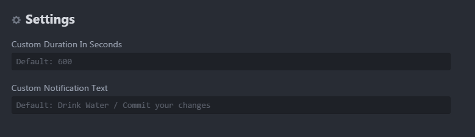
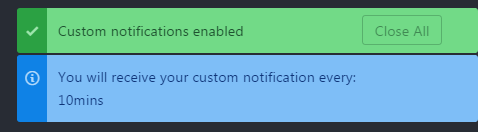
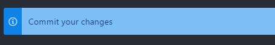

# Custom Notifications

Display custom notifications at regular interval.  

## Installation

Go to `Settings > Install` and then search for `custom-notifications` under `Packages`.

## Configuration

You can configure the notifications in custom-notifications -> settings.

You can customize the following:
 * Custom Duration In Seconds: **Interval duration for the notification.**
 * Custom Notification Text: **Notification Text.**

## Toogle (On / Off) the custom notification

 After Installing and configuring the package, you need to Turn ON the notification.

 For both Turn On and Turn Off the notification, you can do any of the following.

  * Command Palette: **Custom Notifications: Toggle**
  * Context Menu: **Right Click in Atom Editor -> Toggle Custom Notifications**
  * Keyboard Shortcut: **ctrl-shift-c**

When you Toogle Custom Notifications, You will get a confirmation notification.

Then, you will get your custom notifications at regular interval.

You can turn off the Custom Notifications by using the same Toogle options.  
(Command Palette /Context Menu / Keyboard Shortcut)

### Contribute

Pull requests are welcome.  
If you like to add support for a language you work in, feel free to contribute and open a pull request.  
In lieu of a formal style guide, take care to maintain the existing coding style.

### License

Copyright (c) 2017 Senthilprabu Ponnusamy
