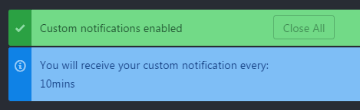

# Regular Notifications

Display regular notifications at regular interval.  

## Installation

Go to `Settings > Install` and then search for `regular-notifications` under `Packages`.

## Configuration

You can configure the notifications in regular-notifications -> settings.

You can customize the following:
 * Duration In Seconds: **Interval duration for the notification.**
 * Notification Text: **Notification Text.**

## Toogle (On / Off) the regular notification

 After Installing and configuring the package, you need to Turn ON the notification.

 For both Turn On and Turn Off the notification, you can do any of the following.

  * Command Palette: **Regular Notifications: Toggle**
  * Context Menu: **Right Click in Atom Editor -> Toggle Regular Notifications**
  * Keyboard Shortcut: **ctrl-alt-c**

When you Toogle regular Notifications, You will get a confirmation notification.

Then, you will get your regular notifications at regular interval.

You can turn off the regular Notifications by using the same Toogle options.  
(Command Palette /Context Menu / Keyboard Shortcut)

### Contribute

Pull requests are welcome.  
If you like to add support for a language you work in, feel free to contribute and open a pull request.  
In lieu of a formal style guide, take care to maintain the existing coding style.

### License

Copyright (c) 2017 Senthilprabu Ponnusamy
